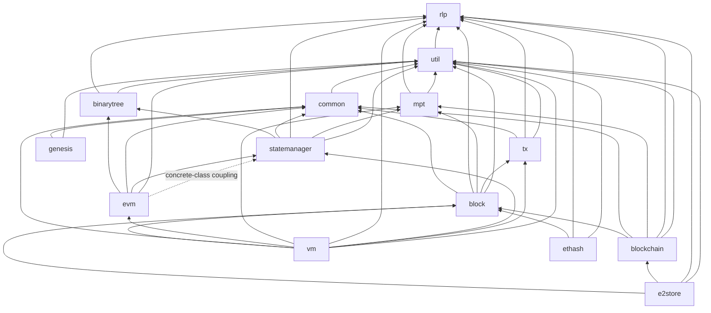

# EthereumJS Monorepo Architecture

This document describes how the packages in this monorepo fit together: what each
package is responsible for, how they depend on each other, how a block flows
through the execution pipeline, where the shared contracts live, and how the
packages are built and released.

Audience: a TypeScript developer who knows Ethereum concepts (blocks,
transactions, state, EVM) but is new to this codebase. All file references are
relative to the repository root and were verified against the source at the time
of writing.

> **Deprecated packages**: `@ethereumjs/client`, `@ethereumjs/devp2p` and
> `@ethereumjs/wallet` are deprecated and no longer updated (see the
> "Deprecated Packages" section in [README.md](./README.md)). They are not
> covered here.

## Package Responsibility Matrix

One row per active package. "Internal deps" is generated from each package's
`package.json` `dependencies` (only `@ethereumjs/*` entries listed; all
packages additionally depend on external libraries such as `@noble/hashes`,
`@noble/curves`, `debug`, `lru-cache` and `eventemitter3`).

| Package | Owns | Does *not* own | Internal deps |
| ------- | ---- | -------------- | ------------- |
| `rlp` | RLP encoding/decoding (`packages/rlp/src/index.ts`). Zero-dependency. | Any Ethereum semantics — it is a pure serialization codec. | — |
| `util` | Low-level primitives: bytes helpers (`bytes.ts`), `Account` (`account.ts`), `Address` (`address.ts`), signatures (`signature.ts`), units (`units.ts`), withdrawals, EIP-7702 authorizations, blobs/KZG plumbing (`kzg.ts`), block-level access lists (`bal/`), plus auxiliary utilities (`provider.ts`, `tasks.ts`, `lock.ts`, `mapDB.ts`, `db.ts`). Error base classes live in `packages/util/src/errors.ts`. | Chain configuration (that is `common`), transaction/block formats. | `rlp` |
| `common` | Chain configuration and hardfork/EIP parameter resolution: the `Common` class (`packages/common/src/common.ts`), chain definitions (`chains.ts`), hardfork schedule (`hardforks.ts`), EIP definitions (`eips.ts`), geth genesis parsing (`gethGenesis.ts`). Also the **shared interface hub**: `packages/common/src/interfaces.ts` (see [Shared Contracts](#shared-contracts)). | Any execution logic or state storage. The per-EIP *parameter values* used by other packages live in those packages' `params.ts` files and are merged into `Common` at construction time (see below). | `util` |
| `tx` | Transaction types and signing: legacy, EIP-2930, EIP-1559, EIP-4844 (blob) and EIP-7702 (setcode) transactions, each in its own directory (`packages/tx/src/{legacy,2930,1559,4844,7702}/`), shared behavior in `capabilities/`, creation entry points in `transactionFactory.ts`. | Transaction *execution* (that is `vm`), receipts. | `common`, `rlp`, `util` |
| `block` | Block and header types: `packages/block/src/{block,header}/`, consensus-format helpers (`consensus/`, `from-beacon-payload.ts`). Builds/validates the transaction trie (`genTxTrie` in `packages/block/src/block/block.ts`). | Chain storage (that is `blockchain`), block execution (that is `vm`). | `common`, `rlp`, `mpt`, `tx`, `util` |
| `blockchain` | Chain storage and canonical-chain management: `packages/blockchain/src/blockchain.ts`, DB layout (`db/`), consensus validation hooks (`consensus/`). Emits `deletedCanonicalBlocks` (typed in `packages/blockchain/src/types.ts`). | Block *execution* — it validates and stores. | `block`, `common`, `mpt`, `rlp`, `util` |
| `mpt` | Merkle Patricia Trie: `packages/mpt/src/mpt.ts`, node types (`node/`), proofs (`proof/`), pluggable DB backends (`db/`). (Renamed from the former `trie` package.) | State *semantics* (accounts/storage) — that is `statemanager`. | `rlp`, `util` |
| `binarytree` | EIP-7864 binary tree state structure: `packages/binarytree/src/binaryTree.ts`, nodes (`node/`), proofs (`proof.ts`). | State semantics — consumed by `statemanager`. | `rlp`, `util` |
| `statemanager` | State access implementations behind a common interface: `MerkleStateManager` (`merkleStateManager.ts`, backed by `@ethereumjs/mpt`), `SimpleStateManager` (`simpleStateManager.ts`, in-memory, no trie), `RPCStateManager` (`rpcStateManager.ts`, reads via JSON-RPC), `StatefulBinaryTreeStateManager` (`statefulBinaryTreeStateManager.ts`, backed by `@ethereumjs/binarytree`). Caching in `cache/`. | The `StateManagerInterface` definition itself — that lives in `common` (see [Shared Contracts](#shared-contracts)). | `binarytree`, `common`, `rlp`, `mpt`, `util` |
| `evm` | Bytecode execution: the `EVM` class (`packages/evm/src/evm.ts`), interpreter loop (`interpreter.ts`), opcode implementations (`opcodes/`), precompiles (`precompiles/`), EOF support (`eof/`), state journaling (`journal.ts`), transient storage (`transientStorage.ts`), access witnesses (`binaryTreeAccessWitness.ts`). | Transaction-level rules (intrinsic gas, nonce/balance checks) and block-level processing — that is `vm`. State storage — it talks to a state manager through `StateManagerInterface`. | `binarytree`, `common`, `statemanager`, `util` |
| `vm` | Transaction and block processing on top of the EVM: `runTx` (`packages/vm/src/runTx.ts`), `runBlock` (`packages/vm/src/runBlock.ts`), block building (`buildBlock.ts`), receipts, EIP-7928 block-level access list consumption (`consumeBal.ts`), withdrawal/request handling (`requests.ts`). | Bytecode interpretation (delegated to `evm`), chain storage (optional `blockchain` is injected via options). | `block`, `common`, `evm`, `mpt`, `rlp`, `statemanager`, `tx`, `util` |
| `genesis` | Genesis state data for known chains: `packages/genesis/src/genesisStates/` (the bulk is the mainnet genesis-state constant), accessor in `index.ts`. | Genesis *block* creation logic (lives in `block`/`blockchain`). | `common`, `util` |
| `e2store` | Era/Era1/E2HS history-archive file formats (`packages/e2store/src/{era,era1,e2hs}/`), history export (`exportHistory.ts`). | Chain logic — it serializes/deserializes archive formats. | `block`, `blockchain`, `rlp`, `util` |
| `ethash` | Ethash proof-of-work hashing and verification (`packages/ethash/src/index.ts`). | Consensus orchestration. | `block`, `rlp`, `util` |

> **Status note**: the root README lists `ethash` under "Deprecated Packages",
> while the release tooling (`ACTIVE_PACKAGES` in `scripts/release-npm.ts`)
> excludes both `ethash` and `e2store` from version bumps (both sit at a
> different version than the rest). Treat these two as maintained-but-frozen.

## Dependency Graph

Derived from the `@ethereumjs/*` entries in each `packages/*/package.json`
(direct dependencies only; `devDependencies` excluded):



Layering, bottom-up: `rlp` → `util` → `common` → data structures
(`mpt`, `binarytree`) → domain types (`tx`, `block`, `genesis`) → state
(`statemanager`) → execution (`evm` → `vm`) → storage/archive
(`blockchain`, `e2store`).

### Known concrete-class couplings (evm → statemanager)

`evm` is designed to consume state through `StateManagerInterface`, but it has
two direct references to the concrete `@ethereumjs/statemanager` package:

1. **Runtime**: `packages/evm/src/constructors.ts:2` imports
   `SimpleStateManager` and instantiates it as the default state manager when
   none is supplied (`createEVM`). This makes `@ethereumjs/statemanager` a hard
   runtime dependency of `evm`.
2. **Type-level**: `packages/evm/src/binaryTreeAccessWitness.ts:29` imports the
   concrete `StatefulBinaryTreeStateManager` type (`import type`) and uses it
   as a parameter type (`generateBinaryExecutionWitness`,
   `binaryTreeAccessWitness.ts:392`), so the public type surface of `evm` is
   coupled to a specific implementation rather than an interface.

Related: `@ethereumjs/binarytree` is declared as a *runtime* dependency in
`packages/evm/package.json`, but the only import in `packages/evm/src` is
type-only (`import type { BinaryTree }` in `binaryTreeAccessWitness.ts:28`).

## Execution Data Flow: One Block, End to End

The call chain for executing a block is
`vm.runBlock → runTx → evm.runCall → interpreter → state manager → trie`.
Functions are free-standing (not methods): you call
`runBlock(vm, opts)` / `runTx(vm, opts)` with a `VM` instance.

1. **`runBlock`** (`packages/vm/src/runBlock.ts:87`)
   - Emits `beforeBlock` (`runBlock.ts:117`), then calls the internal
     `applyBlock` (`runBlock.ts:446`), which performs pre-state setup (DAO
     hardfork handling, EIP-7928 block-level access list initialization at
     `runBlock.ts:128`) and calls `applyTransactions` (`runBlock.ts:675`).
   - `applyTransactions` loops over `block.transactions` and calls `runTx` for
     each (`runBlock.ts:764`), accumulating receipts (built into a receipt trie
     using `MerklePatriciaTrie` imported at `runBlock.ts:4`) and gas used.
   - After transactions: withdrawals, consensus-layer requests
     (`requests.ts`), reward payout, post-state validation (state root,
     receipt root, logs bloom), then emits `afterBlock` (`runBlock.ts:412`).

2. **`runTx`** (`packages/vm/src/runTx.ts:422`, delegating to `_runTx` at
   `runTx.ts:542`)
   - Emits `beforeTx` (`runTx.ts:574`); checkpoints state via the EVM's journal
     (`vm.evm.journal.checkpoint()`, `runTx.ts:466`) and commits or reverts the
     whole transaction atomically (`runTx.ts:511`, `runTx.ts:517`).
   - Handles transaction-level rules: nonce/balance checks, intrinsic gas,
     EIP-1559 fee math, EIP-4844 blob gas, EIP-7702 authorization processing,
     access-list warming — consulting `Common` throughout
     (e.g. `tx.common.param('perEmptyAccountCost')` at `runTx.ts:186`,
     `vm.common.isActivatedEIP(7928)` at `runTx.ts:156`).
   - Invokes the EVM: `vm.evm.runCall({...})` (`runTx.ts:971`), then computes
     refunds, pays the coinbase, generates the receipt
     (`generateTxReceipt`, `runTx.ts:1284`) and emits `afterTx`
     (`runTx.ts:1242`).

3. **`EVM.runCall`** (`packages/evm/src/evm.ts:1209`)
   - Builds a `Message` (`packages/evm/src/message.ts`), checkpoints the
     journal (`evm.ts:1299`), emits `beforeMessage`, and dispatches to
     `_executeCall` (`evm.ts:443`) or `_executeCreate` (`evm.ts:658`), which
     handle value transfer, precompile dispatch (`precompiles/index.ts`), code
     loading and (for creates) init-code rules, then call `runInterpreter`
     (`evm.ts:1119`). Emits `afterMessage` with the `EVMResult`.

4. **`Interpreter.run`** (`packages/evm/src/interpreter.ts:236`)
   - The fetch-decode-execute loop: jump-destination analysis
     (`interpreter.ts:312`), per-opcode gas charging and handler dispatch
     (handlers in `packages/evm/src/opcodes/functions.ts`, gas in
     `opcodes/gas.ts`, opcode table assembly in `opcodes/codes.ts`).
   - Emits a `step` event per opcode when listeners are attached
     (`interpreter.ts:579`; listener check at `interpreter.ts:410`).
   - Hardfork/EIP gating happens via `Common` here too
     (e.g. `this.common.isActivatedEIP(3540)` at `interpreter.ts:237`).
   - Nested calls/creates re-enter the EVM, creating a new journal checkpoint
     per message depth.

5. **State writes: journal → state manager → trie**
   - All state mutations inside execution go through the `Journal`
     (`packages/evm/src/journal.ts`), which tracks touched/created accounts
     and forwards `checkpoint`/`commit`/`revert` to the state manager
     (`journal.ts:116-131`).
   - The state manager persists to its backing structure:
     `MerkleStateManager` wraps a `MerklePatriciaTrie`
     (`packages/statemanager/src/merkleStateManager.ts:103`) with account and
     storage tries; `StatefulBinaryTreeStateManager` wraps a `BinaryTree`
     (`packages/statemanager/src/statefulBinaryTreeStateManager.ts:1`).

### Where `Common` plugs in

- A `Common` instance (chain + hardfork + activated EIPs) is passed in (or
  defaulted) at construction and shared down the stack: `VM` → `EVM` →
  `Interpreter` (`interpreter.ts:196` takes it from the EVM).
- Parameter *values* are decentralized: each package ships a `params.ts`
  (`packages/vm/src/params.ts`, `packages/evm/src/params.ts`,
  `packages/tx/src/params.ts`, `packages/block/src/params.ts`) and merges it
  into the shared `Common` at construction time via `common.updateParams(...)`
  (`packages/evm/src/evm.ts:384`, `packages/vm/src/vm.ts:72`). `Common`
  resolves a `param(name)` lookup against the currently active hardfork/EIP
  set (`packages/common/src/common.ts`).
- `Common` is itself an event source: the EVM re-builds its opcode table when
  the hardfork changes (`this.common.events.on('hardforkChanged', ...)`,
  `evm.ts:394`).

### Events summary

All event emitters are `eventemitter3` instances with typed event maps:

| Emitter | Events | Typed in |
| ------- | ------ | -------- |
| `VM.events` | `beforeBlock`, `afterBlock`, `beforeTx`, `afterTx` | `VMEvent`, `packages/vm/src/types.ts:85` |
| `EVM.events` | `newContract`, `beforeMessage`, `afterMessage`, `step` | `EVMEvent`, `packages/evm/src/types.ts:153` |
| `Blockchain.events` | `deletedCanonicalBlocks` | `BlockchainEvent`, `packages/blockchain/src/types.ts:9` |
| `Common.events` | `hardforkChanged` | `packages/common/src/common.ts` |

Handlers may take an optional `resolve` callback; emission awaits async
listeners (see `EVM['_emit']`, `packages/evm/src/evm.ts:411`).

## Shared Contracts

Cross-package interfaces live in **`packages/common/src/interfaces.ts`**
(~190 lines), making `common` both the chain-config package and the shared
contracts hub. Key exports:

- `StateManagerInterface` (`interfaces.ts:126`) — the contract between
  execution (`evm`, `vm`) and state implementations (`statemanager`).
- `BinaryTreeAccessWitnessInterface` (`interfaces.ts:103`) and the
  `BinaryTreeAccessedState*` types — EIP-7864/witness contracts.
- `StorageDump`, `StorageRange`, `AccountFields`, `Proof` helper types.

Consumers (verified by import): `evm`, `vm`, `statemanager` (and `common`
itself). The `EVMInterface` consumed by `vm` is *not* in `common` — it lives in
`packages/evm/src/types.ts` alongside `EVMEvent`; `BlockchainInterface` lives
in `packages/blockchain/src/types.ts`. So today the contracts are split
between `common` (state) and the defining packages (execution, chain storage).

## Build & Release Pipeline

### Dual CJS/ESM build

Every package's `build` script runs the shared
[`config/cli/ts-build.sh`](./config/cli/ts-build.sh), which performs two `tsc
--build` passes:

- **ESM** via `tsconfig.prod.esm.json` → `dist/esm`
- **CJS** via `tsconfig.prod.cjs.json` → `dist/cjs` (root
  `tsconfig.prod.cjs.json` overrides `module: "CommonJS"` and disables
  `verbatimModuleSyntax`)

then a post-build step writes a one-line `package.json` into each dist dir
stamping `"type": "module"` / `"type": "commonjs"` (`ts-build.sh:64-86`).
Per-package prod tsconfigs declare project `references` mirroring the internal
dependency graph (e.g. `packages/util/tsconfig.prod.esm.json` references
`../rlp`), so `tsc --build` compiles dependencies in order.

Source uses `.ts`-extension relative imports (e.g.
`packages/util/src/index.ts`), enabled by `allowImportingTsExtensions` +
`rewriteRelativeImportExtensions` in the root [`tsconfig.json`](./tsconfig.json)
— the compiler rewrites them to `.js` in emitted output.

### The `typescript` exports condition

Each package's `exports` map has three branches (e.g.
`packages/util/package.json`):

```json
".": {
  "import": {
    "typescript": "./src/index.ts",
    "default": "./dist/esm/index.js"
  },
  "require": "./dist/cjs/index.js"
}
```

The non-standard `typescript` condition lets in-repo tooling that registers it
(e.g. `tsx`, used by the examples runner and tests) resolve cross-package
imports straight to TypeScript source, with no build step. Plain Node and
bundlers fall through to `dist/esm` / `dist/cjs`.

### Docs

Two mechanisms, both per-package:

- **typedoc**: `npm run docs:build` runs `typedoc` with each package's
  `typedoc.mjs`, which extends [`config/typedoc.mjs`](./config/typedoc.mjs)
  (`typedoc-plugin-markdown`, output to `<package>/docs`).
- **embedme**: `npm run examples:build` runs `embedme README.md` — README code
  blocks are *embedded from* the runnable files in `<package>/examples/`, and
  `npm run examples` executes those examples via
  [`scripts/examples-runner.ts`](./scripts/examples-runner.ts) (tsx), keeping
  README snippets honest.

### Release

Releases are script-driven, not changeset/lerna-based:

- [`scripts/release-npm.ts`](./scripts/release-npm.ts): bumps versions for the
  packages in its `ACTIVE_PACKAGES` list (12 packages; excludes `e2store` and
  `ethash`), rewrites inter-package dependency ranges, and publishes in
  dependency order (`PUBLISH_ORDER`, deps first). Supports nightly/alpha tags
  and scoped fork releases.
- [`scripts/release-github.ts`](./scripts/release-github.ts): creates the
  GitHub release entries.

> Note: the root `package.json` still has `"release:simple": "tsx
> ./scripts/simple-release.ts"`, but that file no longer exists — the two
> scripts above are the live path.
