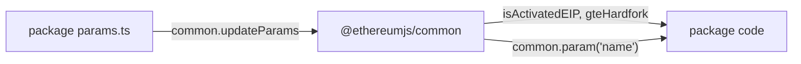

# EthereumJS — Developer Docs

**How we work in this monorepo** — setup, conventions, tooling, releases, and where each procedure is written down.

| | |
| --- | --- |
| **Humans** | Start here. Use the tables below as an index; follow links for depth. |
| **Coding agents** | Start at [AGENTS.md](./AGENTS.md), then the [Cursor rules](#agent-and-cursor-rules) it lists. |

> **One source of truth.** If you change CI, releases, docs, or conventions, update the **canonical file** in the same PR. Do not invent a parallel procedure.

## Contents

- [Sources of truth](#sources-of-truth)
- [Get running](#get-running)
- [Conventions](#conventions)
- [Tooling](#tooling)
- [Releases](#releases)
- [Occasional tasks](#occasional-tasks)
- [Agent and Cursor rules](#agent-and-cursor-rules)
- [Further reading](#further-reading)

---

## Sources of truth

### Documentation and architecture

| Topic | Where |
| ----- | ----- |
| Monorepo landing, package map | [README.md](./README.md) |
| Package graph, execution flow | [ARCHITECTURE.md](./ARCHITECTURE.md) |
| Public API JSDoc | [api-docs.mdc](.cursor/rules/api-docs.mdc) |
| Examples and embedme | [examples.mdc](.cursor/rules/examples.mdc) |
| npm releases and CHANGELOG | [release-round skill](.cursor/skills/release-round/SKILL.md), invariants in [releases.mdc](.cursor/rules/releases.mdc) |

### Code patterns

| Topic | Where |
| ----- | ----- |
| Naming, `createX`, options, `.ts` imports | [code-conventions.mdc](.cursor/rules/code-conventions.mdc) |
| File layout, EIP params, errors (overview) | [§ Conventions](#conventions) below |

### Quality, CI, and security

| Topic | Where |
| ----- | ----- |
| CI job budget, affected packages | [ci.mdc](.cursor/rules/ci.mdc), [ci-affected.mjs](./scripts/ci-affected.mjs) |
| Typecheck finish steps | [typecheck.mdc](.cursor/rules/typecheck.mdc) |
| Spellcheck finish steps | [spellcheck.mdc](.cursor/rules/spellcheck.mdc) |
| Security trust tiers | [security.mdc](.cursor/rules/security.mdc) |
| API tests (Vitest) | [api-tests.mdc](.cursor/rules/api-tests.mdc) |
| Tx tests | [tx-tests.mdc](.cursor/rules/tx-tests.mdc) |

### Package-specific

| Topic | Where |
| ----- | ----- |
| VM consensus fixtures, profiling | [packages/vm/DEVELOPER.md](./packages/vm/DEVELOPER.md) |
| Hive tests (deprecated client) | [packages/client/DEVELOPER.md](./packages/client/DEVELOPER.md) |
| EST fixture bumps | [update-est-fixtures skill](.cursor/skills/update-est-fixtures/SKILL.md) |

---

## Get running

### Layout

[npm workspaces](https://docs.npmjs.com/cli/v7/using-npm/workspaces) link all packages.

```
ethereumjs-monorepo/
├── packages/          @ethereumjs/* libraries
├── config/            shared TS, ESLint, cspell, TypeDoc, config/cli/
├── packages/ethereum-tests/           submodule — legacy vectors
└── packages/execution-spec-tests/   submodule — EST fixtures (see VM docs)
```

Package scripts call helpers under [`config/cli/`](./config/cli/) (`ts-compile.sh`, `ts-build.sh`, `coverage.sh`, `typedoc.sh`, …). See that directory for the full set.

### Clone and install

```sh
git clone https://github.com/ethereumjs/ethereumjs-monorepo.git
cd ethereumjs-monorepo
git submodule update --init
npm install
```

### Commands at a glance

**Repo root**

| Command | What it does |
| ------- | ------------ |
| `npm run lint` / `lint:fix` | ESLint v9 + Biome |
| `npm run tsc --workspaces` | Typecheck all packages (CI gate) |
| `npm run spellcheck` | cspell on TS + markdown |
| `npm run build --workspaces` | Production build |
| `npm run docs:build --workspaces` | TypeDoc → `packages/*/docs/` |
| `npm run clean` | Drop build artifacts + `node_modules` |

**Single package** (example: `@ethereumjs/vm`)

```sh
cd packages/vm
npm run test
npm run tsc
npx vitest test/path/to/test.spec.ts
```

From root: `npm run build --workspace=@ethereumjs/vm`

<details>
<summary>Windows: script-shell for Git Bash</summary>

If script paths fail:

```sh
npm config set script-shell "C:\\Program Files (x86)\\git\\bin\\bash.exe"
```

Reset: `npm config delete script-shell`

</details>

---

## Conventions

Recurring patterns **as they exist today** — descriptive, not aspirational. Enforceable naming lives in [code-conventions.mdc](.cursor/rules/code-conventions.mdc).

| Pattern | Meaning | Examples |
| ------- | ------- | -------- |
| `createX…` | Public factory entry points | `createVM`, `createLegacyTx`, `createBlock` |
| `createXFromY…` | Alternate input formats | `FromRLP`, `FromRPC`, `FromBytesArray` |
| `xToY` | Pure converters | `hexToBytes`, `bytesToBigInt` |
| `isX` | Type guards | `isLegacyTx`, `isHexString` |

### File layout

Most active packages use:

| File | Role |
| ---- | ---- |
| `types.ts` | Public interfaces, `*Opts`, event maps |
| `constructors.ts` | `createX` factories |
| `params.ts` | EIP-indexed params merged into `Common` |

Exceptions: `packages/tx` → `transactionFactory.ts`; `packages/block` → `block/constructors.ts`, `header/constructors.ts`.

### Options, events, imports

- **Options** — constructors and `createX` take one options object (`EVMOpts`, `VMOpts`, …), not long positional lists. Document non-obvious fields on the interface.
- **Events** — `eventemitter3` on `EVM`, `VM`, `Blockchain`, `Common`; event maps in `types.ts`; `events?` optional on option types.
- **ESM imports** — relative paths inside `src/` use explicit `.ts` extensions (rewritten to `.js` in output).

### Errors

Not fully uniform yet (known):

| Piece | Location / note |
| ----- | ---------------- |
| Base class | `EthereumJSError` in `packages/rlp/src/errors.ts`, re-exported via `util` |
| Deprecated helper | `EthereumJSErrorWithoutCode` — use `EthereumJSError` with a `code` |
| EVM-specific | `EVMError` is **not** `Error` / `EthereumJSError` — intentional |

### EIP and parameters



- **Activation** (which EIPs / hardforks) → `common`
- **Numeric values** (gas costs, limits) → each package’s `params.ts`, injected at construction

---

## Tooling

One command and one config pointer per tool. Agent finish steps are in the linked rules — not repeated here.

| Tool | Command | Config | Agent rule |
| ---- | ------- | ------ | ---------- |
| TypeScript | `npm run tsc` / `build` | `config/tsconfig*.json` | [typecheck.mdc](.cursor/rules/typecheck.mdc) |
| Lint | `npm run lint` / `lint:fix` | `eslint.config.mjs` per package | — |
| Spellcheck | `npm run spellcheck` | `config/cspell-*.json` | [spellcheck.mdc](.cursor/rules/spellcheck.mdc) |
| Tests | `npm run test` | Vitest per package | [api-tests.mdc](.cursor/rules/api-tests.mdc), [tx-tests.mdc](.cursor/rules/tx-tests.mdc) |
| API docs | `npm run docs:build` | `config/cli/typedoc.sh`, `typedoc/` | [api-docs.mdc](.cursor/rules/api-docs.mdc) |
| Examples | `npm run examples` | `packages/*/examples/` | [examples.mdc](.cursor/rules/examples.mdc) |
| CI | PR check **`Build / CI`** | `.github/workflows/` | [ci.mdc](.cursor/rules/ci.mdc) |

### Notes

**TypeScript** — `npm test` does **not** run `tsc`. After TS edits, typecheck the touched package(s).

**Testing** — CI runs affected packages via [ci-affected.mjs](./scripts/ci-affected.mjs). Skipped per-package jobs still count as success. Lint, typecheck, and `npm audit` always run. Full matrix on `master`, workflow dispatch, or shared-config changes. `vm-est-dev` is informational, not gated.

VM consensus runners: [packages/vm/DEVELOPER.md](./packages/vm/DEVELOPER.md).

**Browser tests** — optional locally. Once: `npm run install-browser-deps`, then `npm run test:browser`. CI uses `mcr.microsoft.com/playwright:v1.60.0-noble` — keep in sync with `playwright` in `package-lock.json`.

**Documentation** — TypeDoc 0.28 needs TS 6; monorepo `tsc` uses TS 7. Always use [`config/cli/typedoc.sh`](./config/cli/typedoc.sh), not bare `typedoc`. Cross-package `{@link}` → [`typedoc-external-links.mjs`](./config/typedoc-external-links.mjs).

**Examples** — README snippets sync via embedme: `npm run examples:build` in a package after editing `examples/`.

---

## Releases

Active packages ([README § Package map](./README.md#package-map)) ship **in sync** with the **same version number**.

| Type | When |
| ---- | ---- |
| Bugfix | Most rounds; may include non-finalized EIP behavior |
| Minor | Hardfork finalization or selected features |
| Major | Rare; structural API breaks |

### Branches

| Branch | Series | Status |
| ------ | ------ | ------ |
| [`master`](https://github.com/ethereumjs/ethereumjs-monorepo) | v10 | Active |
| [`maintenance-v8`](https://github.com/ethereumjs/ethereumjs-monorepo/tree/maintenance-v8) | v7 / v8 | Maintenance |
| [`maintenance-v6`](https://github.com/ethereumjs/ethereumjs-monorepo/tree/maintenance-v6) | v6 | Maintenance |

Open PRs against the working branch unless backporting. Past releases: [tags](https://github.com/ethereumjs/ethereumjs-monorepo/tags).

**Procedure** — [release-round skill](.cursor/skills/release-round/SKILL.md) (six gated phases: intent, CHANGELOG, bump, publish, verify, announce). Invariants: [releases.mdc](.cursor/rules/releases.mdc). Commands live in the script headers ([release-npm.ts](./scripts/release-npm.ts), [release-github.ts](./scripts/release-github.ts)). Do not publish without an explicit maintainer request.

---

## Occasional tasks

**Local npm link**

```sh
cd packages/package-name && npm run build && npm link
cd path/to/your/project && npm link @ethereumjs/package-name
# rebuild after changes; unlink when done
```

**Shared toolchain** — `eslint`, `biome`, `typescript`, … live in the root `package.json`.

**Security** — wrong hashes or EVM results are consensus bugs. Trust tiers: [security.mdc](.cursor/rules/security.mdc). Extra care on `tx`, `util` signing, and `evm` / `vm` spec tests.

---

## Agent and Cursor rules

Rules: [`.cursor/rules/`](.cursor/rules/) (plain markdown + YAML front matter — works outside Cursor too).

| Rule | Scope | Remember |
| ---- | ----- | -------- |
| `ci`, `typecheck`, `spellcheck`, `git`, `security` | Always on | Do not weaken tests or skip hooks |
| `code-conventions` | `src/`, `examples/` | No public API renames without human ask |
| `api-docs` | `src/` | Cross-package `{@link @ethereumjs/pkg!Symbol}` |
| `examples` | `examples/`, READMEs | Run embedme after README edits |
| `api-tests` | active `test/` | VM consensus runners out of scope |
| `tx-tests` | `packages/tx` | 4844 matrix uses stub KZG |
| `releases` | CHANGELOG, release scripts | Procedure: `release-round` skill; never publish without approval |

**Skill:** [update-est-fixtures](.cursor/skills/update-est-fixtures/SKILL.md) — EST fixture bumps only.

Package-specific depth stays in package `DEVELOPER.md` files. [AGENTS.md](./AGENTS.md) is the agent index — not a second copy of this document.

---

## Further reading

| Doc | Covers |
| --- | ------ |
| [ARCHITECTURE.md](./ARCHITECTURE.md) | Responsibilities, dependency graph, `runBlock` flow |
| [packages/vm/DEVELOPER.md](./packages/vm/DEVELOPER.md) | EST / legacy tests, debugging, profiling |
| [packages/client/DEVELOPER.md](./packages/client/DEVELOPER.md) | Hive (deprecated `@ethereumjs/client`) |
| [CONTRIBUTING.md](./.github/CONTRIBUTING.md) | How to contribute |
| [CODE_OF_CONDUCT.md](./CODE_OF_CONDUCT.md) | Community standards |
