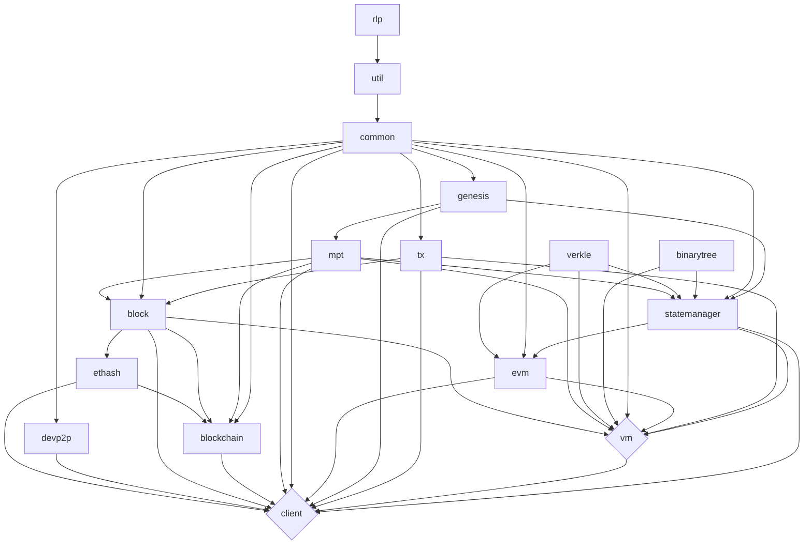

<p align="center">
  
</p>

# EthereumJS Monorepo

## Table of Contents

- [Introduction](#introduction)
- [Packages Overview](#packages-overview)
- [Getting Started](#getting-started)
- [Branches](#branches)
- [Packages Relationships](#packages-relationships)
- [EthereumJS](#ethereumjs)
- [License](#license)

## Introduction

[![Code Coverage][coverage-badge]][coverage-link]
[![Discord][discord-badge]][discord-link]

This repository holds various protocol building blocks of the [Ethereum](https://ethereum.org) blockchain execution layer and is managed by the [Ethereum Foundation](https://ethereum.foundation/) JavaScript team. There is a TypeScript implementation of the [Ethereum Virtual Machine (EVM)][vm-package] ready to be used in Node.js or a browser environment, implementations of core structural blockchain building blocks like an Ethereum [Tx][tx-package], [Block][block-package] or [Blockchain][blockchain-package] as well as a [MPT][mpt-package] (Merkle Patricia Tree) and [devp2p][devp2p-package] (execution networking layer) implementation.

All libraries are bound together by the core [Common][common-package] library keeping track of chain specifics and hardfork changes. They are complemented by helper packages like [RLP][rlp-package] for data encoding/decoding or [Util][util-package], providing helper functionalities like (byte) conversion, signatures, types and others.

Finally, the [EthereumJS Execution Client][client-package] (EthereumJS) has been in active development for some time now. It already serves a variety of purposes like testing, research (e.g. EIPs) and developer tooling to engage with the protocol.

Also to note: on the Ethereum Consensus side, the ChainSafe [Lodestar](https://github.com/ChainSafe/lodestar) repository complements this repository with an Ethereum Consensus Client implementation as well as various protocol implementations (like an SSZ library) developed in the context of Ethereum Consensus layer evolution.

## Packages Overview

Below you can find a list of the packages included in this repository.

| package                                          | npm                                                             | issues                                                                        | tests                                                                      | coverage                                                                    |
| ------------------------------------------------ | --------------------------------------------------------------- | ----------------------------------------------------------------------------- | -------------------------------------------------------------------------- | --------------------------------------------------------------------------- |
| [@ethereumjs/binarytree][binarytree-package]             | [![NPM Package][binarytree-npm-badge]][binarytree-npm-link]             | [![VM Issues][binarytree-issues-badge]][binarytree-issues-link]                       | [![Actions Status][binarytree-actions-badge]][binarytree-actions-link]             | [![Code Coverage][binarytree-coverage-badge]][binarytree-coverage-link]     
| [@ethereumjs/block][block-package]               | [![NPM Package][block-npm-badge]][block-npm-link]               | [![Block Issues][block-issues-badge]][block-issues-link]                      | [![Actions Status][block-actions-badge]][block-actions-link]               | [![Code Coverage][block-coverage-badge]][block-coverage-link]               |
| [@ethereumjs/blockchain][blockchain-package]     | [![NPM Package][blockchain-npm-badge]][blockchain-npm-link]     | [![Blockchain Issues][blockchain-issues-badge]][blockchain-issues-link]       | [![Actions Status][blockchain-actions-badge]][blockchain-actions-link]     | [![Code Coverage][blockchain-coverage-badge]][blockchain-coverage-link]     |
| [@ethereumjs/client][client-package]             | [![NPM Package][client-npm-badge]][client-npm-link]             | [![Client Issues][client-issues-badge]][client-issues-link]                   | [![Actions Status][client-actions-badge]][client-actions-link]             | [![Code Coverage][client-coverage-badge]][client-coverage-link]             |
| [@ethereumjs/common][common-package]             | [![NPM Package][common-npm-badge]][common-npm-link]             | [![Common Issues][common-issues-badge]][common-issues-link]                   | [![Actions Status][common-actions-badge]][common-actions-link]             | [![Code Coverage][common-coverage-badge]][common-coverage-link]             |
| [@ethereumjs/devp2p][devp2p-package]             | [![NPM Package][devp2p-npm-badge]][devp2p-npm-link]             | [![Devp2p Issues][devp2p-issues-badge]][devp2p-issues-link]                   | [![Actions Status][devp2p-actions-badge]][devp2p-actions-link]             | [![Code Coverage][devp2p-coverage-badge]][devp2p-coverage-link]             |
| [@ethereumjs/ethash][ethash-package]             | [![NPM Package][ethash-npm-badge]][ethash-npm-link]             | [![Ethash Issues][ethash-issues-badge]][ethash-issues-link]                   | [![Actions Status][ethash-actions-badge]][ethash-actions-link]             | [![Code Coverage][ethash-coverage-badge]][ethash-coverage-link]             |
| [@ethereumjs/evm][evm-package]                   | [![NPM Package][evm-npm-badge]][evm-npm-link]                   | [![EVM Issues][evm-issues-badge]][evm-issues-link]                            | [![Actions Status][evm-actions-badge]][evm-actions-link]                   | [![Code Coverage][evm-coverage-badge]][evm-coverage-link]                   |
| [@ethereumjs/genesis][genesis-package]           | [![NPM Package][genesis-npm-badge]][genesis-npm-link]           | [![Genesis Issues][genesis-issues-badge]][genesis-issues-link]                | [![Actions Status][genesis-actions-badge]][genesis-actions-link]           | [![Code Coverage][genesis-coverage-badge]][genesis-coverage-link]           |
| [@ethereumjs/mpt][mpt-package]                   | [![NPM Package][mpt-npm-badge]][mpt-npm-link]                   | [![MPT Issues][mpt-issues-badge]][mpt-issues-link]                            | [![Actions Status][mpt-actions-badge]][mpt-actions-link]                   | [![Code Coverage][mpt-coverage-badge]][mpt-coverage-link]
| [@ethereumjs/rlp][rlp-package]                   | [![NPM Package][rlp-npm-badge]][rlp-npm-link]                   | [![rlp Issues][rlp-issues-badge]][rlp-issues-link]                            | [![Actions Status][rlp-actions-badge]][rlp-actions-link]                   | [![Code Coverage][rlp-coverage-badge]][rlp-coverage-link]                   |
| [@ethereumjs/statemanager][statemanager-package] | [![NPM Package][statemanager-npm-badge]][statemanager-npm-link] | [![StateManager Issues][statemanager-issues-badge]][statemanager-issues-link] | [![Actions Status][statemanager-actions-badge]][statemanager-actions-link] | [![Code Coverage][statemanager-coverage-badge]][statemanager-coverage-link] |                 |
| [@ethereumjs/tx][tx-package]                     | [![NPM Package][tx-npm-badge]][tx-npm-link]                     | [![Tx Issues][tx-issues-badge]][tx-issues-link]                               | [![Actions Status][tx-actions-badge]][tx-actions-link]                     | [![Code Coverage][tx-coverage-badge]][tx-coverage-link]                     |
| [@ethereumjs/util][util-package]                 | [![NPM Package][util-npm-badge]][util-npm-link]                 | [![Util Issues][util-issues-badge]][util-issues-link]                         | [![Actions Status][util-actions-badge]][util-actions-link]                 | [![Code Coverage][util-coverage-badge]][util-coverage-link]                 |
| [@ethereumjs/verkle][verkle-package]             | [![NPM Package][verkle-npm-badge]][verkle-npm-link]             | [![VM Issues][verkle-issues-badge]][verkle-issues-link]                       | [![Actions Status][verkle-actions-badge]][verkle-actions-link]             | [![Code Coverage][verkle-coverage-badge]][verkle-coverage-link]             |
| [@ethereumjs/vm][vm-package]                     | [![NPM Package][vm-npm-badge]][vm-npm-link]                     | [![VM Issues][vm-issues-badge]][vm-issues-link]                               | [![Actions Status][vm-actions-badge]][vm-actions-link]                     | [![Code Coverage][vm-coverage-badge]][vm-coverage-link]                     |
| [@ethereumjs/wallet][wallet-package]             | [![NPM Package][wallet-npm-badge]][wallet-npm-link]             | [![StateManager Issues][wallet-issues-badge]][wallet-issues-link]             | [![Actions Status][wallet-actions-badge]][wallet-actions-link]             | [![Code Coverage][wallet-coverage-badge]][wallet-coverage-link]             |

## Getting Started

If you're new to the EthereumJS monorepo, this section will help you get up and running quickly.

### Prerequisites

- Node.js (v18 or higher)
- npm (v8 or higher)
- Git

### Initial Setup

1. **Clone the repository and initialize submodules**:

```sh
git clone https://github.com/ethereumjs/ethereumjs-monorepo.git
cd ethereumjs-monorepo
git submodule init
git submodule update
```

2. **Install dependencies**:

```sh
npm install
```

### Development Workflow

The monorepo uses [npm workspaces](https://docs.npmjs.com/cli/v7/using-npm/workspaces) to link local packages together, making development easier.

#### Common Commands

- **Clean the workspace**: `npm run clean` - Removes build artifacts and node_modules
- **Lint code**: `npm run lint --workspaces` - Check code style with ESLint v9 and Biome
- **Fix linting issues**: `npm run lint:fix --workspaces` - Automatically fix style issues
- **Build all packages**: `npm run build --workspaces` - Build all packages in the monorepo
- **Build documentation**: `npm run docs:build --workspaces` - Generate documentation for all packages

#### Working on a Specific Package

To focus on a single package (e.g., VM):

1. Navigate to the package directory: `cd packages/vm`
2. Run tests: `npm test`
3. Run a specific test: `npx vitest test/path/to/test.spec.ts`
4. Build just that package: `npm run build --workspace=@ethereumjs/vm`

#### Cross-Package Development

All packages include a `typescript` entry in the exports map that allows direct use of TypeScript sources without recompilation:

- Run tests with TypeScript sources: `npx vitest --config ../../config/vitest.config.mts test/myTest.spec.ts`
- Run TypeScript scripts: `tsx --conditions=typescript myScript.ts`
- Set environment variable for bash scripts: `NODE_OPTIONS='--conditions=typescript'`

### Browser Testing

We use `vitest` with `playwright` to run browser tests.  When running browser tests with `npm run test:browser`, ensure you have a version of the Chromium browser installed.  If not, you can run `npx playwright install --with-deps` to install a supported version.

### Testing Packages with an external project

To test changes locally before publishing, use npm link:

1. **Build the package you want to test**:

```sh
cd packages/vm  # Or another package
npm run build
```

2. **Link the package globally**:

```sh
npm link
```

3. **In your test project, link to the local package**:

```sh
cd path/to/your/project
npm link @ethereumjs/vm  # Use the appropriate package name
```

4. **When you're done, unlink the package**:

```sh
# In your test project
npm unlink @ethereumjs/vm

# In the package directory
npm unlink
```

When making changes to the linked package, rebuild it for the changes to be reflected in your test project.

### Windows Users Note

Windows users might encounter errors with script paths. To fix, configure Git bash as the script shell:

```sh
npm config set script-shell "C:\\Program Files (x86)\\git\\bin\\bash.exe"
```

To reset this setting:

```sh
npm config delete script-shell
```

### Configuration Guide

The [config](config/) folder gives an overview on shared configuration and scripts between packages.

You can find more detailed information on the configuration of different tooling and language parts (TypeScript, linting, testing,...) in the specific [Configuration Guide](./config/README.md).

## Branches

### Overview

The following are our currently relevant main branches for active and former release series:

| Branch                                                                                  | Release Series         | Status        |  Description                                   |
| --------------------------------------------------------------------------------------- | ---------------------- | ------------- | ---------------------------------------------- |
| [master](https://github.com/ethereumjs/ethereumjs-monorepo)                             | v10 (new versioning scheme) | `Active`     | Working branch                          |
| [maintenance-v8](https://github.com/ethereumjs/ethereumjs-monorepo/tree/maintenance-v8) | v7/v8                  | `Maintenance` | Maintenance for v8 releases (v7 also included) |
| [maintenance-v6](https://github.com/ethereumjs/ethereumjs-monorepo/tree/maintenance-v6) | v6                     | `Maintenance` | Maintenance for v6 releases                    |

### Breaking Releases

Breaking releases are mostly done in sync for all libraries (latest exceptions: VM v8, EVM v3). Starting with the spring 2025 release series, we have aligned all package versions to have the same major version number. This makes it easier to clearly identify package versions compatible with each other as well as reason about functionality or bugs for a certain release series.

Old release cycles up to the VM v7/v8 version were named after the `@ethereumjs/vm` version. In most cases PRs should be opened towards the current working branch. If there is no current working branch, please ask! 🙂

To inspect code related to a specific package version, refer to the [tags](https://github.com/ethereumjs/ethereumjs-monorepo/tags).

## Packages Relationships



To update the diagram above edit the README file and open a new PR with the changes.

## EthereumJS

See our organizational [documentation](https://ethereumjs.readthedocs.io) for an introduction to `EthereumJS` as well as information on current standards and best practices. If you want to join for work or carry out improvements on the libraries, please review our [contribution guidelines](https://ethereumjs.readthedocs.io/en/latest/contributing.html) first.

## License

Most packages are [MPL-2.0](<https://tldrlegal.com/license/mozilla-public-license-2.0-(mpl-2)>) licensed, see package folder for the respective license.

[coverage-badge]: https://codecov.io/gh/ethereumjs/ethereumjs-monorepo/branch/master/graph/badge.svg
[coverage-link]: https://codecov.io/gh/ethereumjs/ethereumjs-monorepo

[discord-badge]: https://img.shields.io/static/v1?logo=discord&label=discord&message=Join&color=blue
[discord-link]: https://discord.gg/TNwARpR

[binarytree-package]: ./packages/binarytree
[binarytree-npm-badge]: https://img.shields.io/npm/v/@ethereumjs/binarytree.svg
[binarytree-npm-link]: https://www.npmjs.com/package/@ethereumjs/binarytree
[binarytree-issues-badge]: https://img.shields.io/github/issues/ethereumjs/ethereumjs-monorepo/package:%20binarytree?label=issues
[binarytree-issues-link]: https://github.com/ethereumjs/ethereumjs-monorepo/issues?q=is%3Aopen+is%3Aissue+label%3A"package%3A+binarytree"
[binarytree-actions-badge]: https://github.com/ethereumjs/ethereumjs-monorepo/workflows/binarytree/badge.svg
[binarytree-actions-link]: https://github.com/ethereumjs/ethereumjs-monorepo/actions?query=workflow%3A%22binarytree%22
[binarytree-coverage-badge]: https://codecov.io/gh/ethereumjs/ethereumjs-monorepo/branch/master/graph/badge.svg?flag=binarytree
[binarytree-coverage-link]: https://codecov.io/gh/ethereumjs/ethereumjs-monorepo/tree/master/packages/binarytree

[block-package]: ./packages/block
[block-npm-badge]: https://img.shields.io/npm/v/@ethereumjs/block.svg
[block-npm-link]: https://www.npmjs.com/package/@ethereumjs/block
[block-issues-badge]: https://img.shields.io/github/issues/ethereumjs/ethereumjs-monorepo/package:%20block?label=issues
[block-issues-link]: https://github.com/ethereumjs/ethereumjs-monorepo/issues?q=is%3Aopen+is%3Aissue+label%3A"package%3A+block"
[block-actions-badge]: https://github.com/ethereumjs/ethereumjs-monorepo/workflows/Block/badge.svg
[block-actions-link]: https://github.com/ethereumjs/ethereumjs-monorepo/actions?query=workflow%3A%22Block%22
[block-coverage-badge]: https://codecov.io/gh/ethereumjs/ethereumjs-monorepo/branch/master/graph/badge.svg?flag=block
[block-coverage-link]: https://codecov.io/gh/ethereumjs/ethereumjs-monorepo/tree/master/packages/block

[blockchain-package]: ./packages/blockchain
[blockchain-npm-badge]: https://img.shields.io/npm/v/@ethereumjs/blockchain.svg
[blockchain-npm-link]: https://www.npmjs.com/package/@ethereumjs/blockchain
[blockchain-issues-badge]: https://img.shields.io/github/issues/ethereumjs/ethereumjs-monorepo/package:%20blockchain?label=issues
[blockchain-issues-link]: https://github.com/ethereumjs/ethereumjs-monorepo/issues?q=is%3Aopen+is%3Aissue+label%3A"package%3A+blockchain"
[blockchain-actions-badge]: https://github.com/ethereumjs/ethereumjs-monorepo/workflows/Blockchain/badge.svg
[blockchain-actions-link]: https://github.com/ethereumjs/ethereumjs-monorepo/actions?query=workflow%3A%22Blockchain%22
[blockchain-coverage-badge]: https://codecov.io/gh/ethereumjs/ethereumjs-monorepo/branch/master/graph/badge.svg?flag=blockchain
[blockchain-coverage-link]: https://codecov.io/gh/ethereumjs/ethereumjs-monorepo/tree/master/packages/blockchain

[client-package]: ./packages/client
[client-npm-badge]: https://img.shields.io/npm/v/@ethereumjs/client.svg
[client-npm-link]: https://www.npmjs.com/package/@ethereumjs/client
[client-issues-badge]: https://img.shields.io/github/issues/ethereumjs/ethereumjs-monorepo/package:%20client?label=issues
[client-issues-link]: https://github.com/ethereumjs/ethereumjs-monorepo/issues?q=is%3Aopen+is%3Aissue+label%3A"package%3A+client"
[client-actions-badge]: https://github.com/ethereumjs/ethereumjs-monorepo/workflows/Client/badge.svg
[client-actions-link]: https://github.com/ethereumjs/ethereumjs-monorepo/actions?query=workflow%3A%22Client%22
[client-coverage-badge]: https://codecov.io/gh/ethereumjs/ethereumjs-monorepo/branch/master/graph/badge.svg?flag=client
[client-coverage-link]: https://codecov.io/gh/ethereumjs/ethereumjs-monorepo/tree/master/packages/client

[common-package]: ./packages/common
[common-npm-badge]: https://img.shields.io/npm/v/@ethereumjs/common.svg
[common-npm-link]: https://www.npmjs.com/package/@ethereumjs/common
[common-issues-badge]: https://img.shields.io/github/issues/ethereumjs/ethereumjs-monorepo/package:%20common?label=issues
[common-issues-link]: https://github.com/ethereumjs/ethereumjs-monorepo/issues?q=is%3Aopen+is%3Aissue+label%3A"package%3A+common"
[common-actions-badge]: https://github.com/ethereumjs/ethereumjs-monorepo/workflows/Common/badge.svg
[common-actions-link]: https://github.com/ethereumjs/ethereumjs-monorepo/actions?query=workflow%3A%22Common%22
[common-coverage-badge]: https://codecov.io/gh/ethereumjs/ethereumjs-monorepo/branch/master/graph/badge.svg?flag=common
[common-coverage-link]: https://codecov.io/gh/ethereumjs/ethereumjs-monorepo/tree/master/packages/common

[devp2p-package]: ./packages/devp2p
[devp2p-npm-badge]: https://img.shields.io/npm/v/@ethereumjs/devp2p.svg
[devp2p-npm-link]: https://www.npmjs.com/package/@ethereumjs/devp2p
[devp2p-issues-badge]: https://img.shields.io/github/issues/ethereumjs/ethereumjs-monorepo/package:%20devp2p?label=issues
[devp2p-issues-link]: https://github.com/ethereumjs/ethereumjs-monorepo/issues?q=is%3Aopen+is%3Aissue+label%3A"package%3A+devp2p"
[devp2p-actions-badge]: https://github.com/ethereumjs/ethereumjs-monorepo/workflows/Devp2p/badge.svg
[devp2p-actions-link]: https://github.com/ethereumjs/ethereumjs-monorepo/actions?query=workflow%3A%22Devp2p%22
[devp2p-coverage-badge]: https://codecov.io/gh/ethereumjs/ethereumjs-monorepo/branch/master/graph/badge.svg?flag=devp2p
[devp2p-coverage-link]: https://codecov.io/gh/ethereumjs/ethereumjs-monorepo/tree/master/packages/devp2p

[ethash-package]: ./packages/ethash
[ethash-npm-badge]: https://img.shields.io/npm/v/@ethereumjs/ethash.svg
[ethash-npm-link]: https://www.npmjs.org/package/@ethereumjs/ethash
[ethash-issues-badge]: https://img.shields.io/github/issues/ethereumjs/ethereumjs-monorepo/package:%20ethash?label=issues
[ethash-issues-link]: https://github.com/ethereumjs/ethereumjs-monorepo/issues?q=is%3Aopen+is%3Aissue+label%3A"package%3A+ethash"
[ethash-actions-badge]: https://github.com/ethereumjs/ethereumjs-monorepo/workflows/Ethash/badge.svg
[ethash-actions-link]: https://github.com/ethereumjs/ethereumjs-monorepo/actions?query=workflow%3A%22Ethash%22
[ethash-coverage-badge]: https://codecov.io/gh/ethereumjs/ethereumjs-monorepo/branch/master/graph/badge.svg?flag=ethash
[ethash-coverage-link]: https://codecov.io/gh/ethereumjs/ethereumjs-monorepo/tree/master/packages/ethash

[evm-package]: ./packages/evm
[evm-npm-badge]: https://img.shields.io/npm/v/@ethereumjs/evm.svg
[evm-npm-link]: https://www.npmjs.org/package/@ethereumjs/evm
[evm-issues-badge]: https://img.shields.io/github/issues/ethereumjs/ethereumjs-monorepo/package:%20evm?label=issues
[evm-issues-link]: https://github.com/ethereumjs/ethereumjs-monorepo/issues?q=is%3Aopen+is%3Aissue+label%3A"package%3A+evm"
[evm-actions-badge]: https://github.com/ethereumjs/ethereumjs-monorepo/workflows/EVM/badge.svg
[evm-actions-link]: https://github.com/ethereumjs/ethereumjs-monorepo/actions?query=workflow%3A%22evm%22
[evm-coverage-badge]: https://codecov.io/gh/ethereumjs/ethereumjs-monorepo/branch/master/graph/badge.svg?flag=evm
[evm-coverage-link]: https://codecov.io/gh/ethereumjs/ethereumjs-monorepo/tree/master/packages/evm

[genesis-package]: ./packages/genesis
[genesis-npm-badge]: https://img.shields.io/npm/v/@ethereumjs/genesis.svg
[genesis-npm-link]: https://www.npmjs.com/package/@ethereumjs/genesis
[genesis-issues-badge]: https://img.shields.io/github/issues/ethereumjs/ethereumjs-monorepo/package:%20genesis?label=issues
[genesis-issues-link]: https://github.com/ethereumjs/ethereumjs-monorepo/issues?q=is%3Aopen+is%3Aissue+label%3A"package%3A+genesis"
[genesis-actions-badge]: https://github.com/ethereumjs/ethereumjs-monorepo/workflows/genesis/badge.svg
[genesis-actions-link]: https://github.com/ethereumjs/ethereumjs-monorepo/actions?query=workflow%3A%22genesis%22
[genesis-coverage-badge]: https://codecov.io/gh/ethereumjs/ethereumjs-monorepo/branch/master/graph/badge.svg?flag=genesis
[genesis-coverage-link]: https://codecov.io/gh/ethereumjs/ethereumjs-monorepo/tree/master/packages/genesis

[mpt-package]: ./packages/mpt
[mpt-npm-badge]: https://img.shields.io/npm/v/@ethereumjs/mpt.svg
[mpt-npm-link]: https://www.npmjs.com/package/@ethereumjs/mpt
[mpt-issues-badge]: https://img.shields.io/github/issues/ethereumjs/ethereumjs-monorepo/package:%20mpt?label=issues
[mpt-issues-link]: https://github.com/ethereumjs/ethereumjs-monorepo/issues?q=is%3Aopen+is%3Aissue+label%3A"package%3A+mpt"
[mpt-actions-badge]: https://github.com/ethereumjs/ethereumjs-monorepo/workflows/MPT/badge.svg
[mpt-actions-link]: https://github.com/ethereumjs/ethereumjs-monorepo/actions?query=workflow%3A%22MPT%22
[mpt-coverage-badge]: https://codecov.io/gh/ethereumjs/ethereumjs-monorepo/branch/master/graph/badge.svg?flag=mpt
[mpt-coverage-link]: https://codecov.io/gh/ethereumjs/ethereumjs-monorepo/tree/master/packages/mpt

[rlp-package]: ./packages/rlp
[rlp-npm-badge]: https://img.shields.io/npm/v/@ethereumjs/rlp.svg
[rlp-npm-link]: https://www.npmjs.com/package/@ethereumjs/rlp
[rlp-issues-badge]: https://img.shields.io/github/issues/ethereumjs/ethereumjs-monorepo/package:%20rlp?label=issues
[rlp-issues-link]: https://github.com/ethereumjs/ethereumjs-monorepo/issues?q=is%3Aopen+is%3Aissue+label%3A"package%3A+rlp"
[rlp-actions-badge]: https://github.com/ethereumjs/ethereumjs-monorepo/workflows/RLP/badge.svg
[rlp-actions-link]: https://github.com/ethereumjs/ethereumjs-monorepo/actions?query=workflow%3A%22RLP%22
[rlp-coverage-badge]: https://codecov.io/gh/ethereumjs/ethereumjs-monorepo/branch/master/graph/badge.svg?flag=rlp
[rlp-coverage-link]: https://codecov.io/gh/ethereumjs/ethereumjs-monorepo/tree/master/packages/rlp

[statemanager-package]: ./packages/statemanager
[statemanager-npm-badge]: https://img.shields.io/npm/v/@ethereumjs/statemanager.svg
[statemanager-npm-link]: https://www.npmjs.com/package/@ethereumjs/statemanager
[statemanager-issues-badge]: https://img.shields.io/github/issues/ethereumjs/ethereumjs-monorepo/package:%20statemanager?label=issues
[statemanager-issues-link]: https://github.com/ethereumjs/ethereumjs-monorepo/issues?q=is%3Aopen+is%3Aissue+label%3A"package%3A+statemanager"
[statemanager-actions-badge]: https://github.com/ethereumjs/ethereumjs-monorepo/workflows/StateManager/badge.svg
[statemanager-actions-link]: https://github.com/ethereumjs/ethereumjs-monorepo/actions?query=workflow%3A%22StateManager%22
[statemanager-coverage-badge]: https://codecov.io/gh/ethereumjs/ethereumjs-monorepo/branch/master/graph/badge.svg?flag=statemanager
[statemanager-coverage-link]: https://codecov.io/gh/ethereumjs/ethereumjs-monorepo/tree/master/packages/statemanager

[tx-package]: ./packages/tx
[tx-npm-badge]: https://img.shields.io/npm/v/@ethereumjs/tx.svg
[tx-npm-link]: https://www.npmjs.com/package/@ethereumjs/tx
[tx-issues-badge]: https://img.shields.io/github/issues/ethereumjs/ethereumjs-monorepo/package:%20tx?label=issues
[tx-issues-link]: https://github.com/ethereumjs/ethereumjs-monorepo/issues?q=is%3Aopen+is%3Aissue+label%3A"package%3A+tx"
[tx-actions-badge]: https://github.com/ethereumjs/ethereumjs-monorepo/workflows/Tx/badge.svg
[tx-actions-link]: https://github.com/ethereumjs/ethereumjs-monorepo/actions?query=workflow%3A%22Tx%22
[tx-coverage-badge]: https://codecov.io/gh/ethereumjs/ethereumjs-monorepo/branch/master/graph/badge.svg?flag=tx
[tx-coverage-link]: https://codecov.io/gh/ethereumjs/ethereumjs-monorepo/tree/master/packages/tx

[util-package]: ./packages/util
[util-npm-badge]: https://img.shields.io/npm/v/@ethereumjs/util.svg
[util-npm-link]: https://www.npmjs.org/package/@ethereumjs/util
[util-issues-badge]: https://img.shields.io/github/issues/ethereumjs/ethereumjs-monorepo/package:%20util?label=issues
[util-issues-link]: https://github.com/ethereumjs/ethereumjs-monorepo/issues?q=is%3Aopen+is%3Aissue+label%3A"package%3A+util"
[util-actions-badge]: https://github.com/ethereumjs/ethereumjs-monorepo/workflows/Util/badge.svg
[util-actions-link]: https://github.com/ethereumjs/ethereumjs-monorepo/actions?query=workflow%3A%22Util%22
[util-coverage-badge]: https://codecov.io/gh/ethereumjs/ethereumjs-monorepo/branch/master/graph/badge.svg?flag=util
[util-coverage-link]: https://codecov.io/gh/ethereumjs/ethereumjs-monorepo/tree/master/packages/util

[verkle-package]: ./packages/verkle
[verkle-npm-badge]: https://img.shields.io/npm/v/@ethereumjs/verkle.svg
[verkle-npm-link]: https://www.npmjs.com/package/@ethereumjs/verkle
[verkle-issues-badge]: https://img.shields.io/github/issues/ethereumjs/ethereumjs-monorepo/package:%20verkle?label=issues
[verkle-issues-link]: https://github.com/ethereumjs/ethereumjs-monorepo/issues?q=is%3Aopen+is%3Aissue+label%3A"package%3A+verkle"
[verkle-actions-badge]: https://github.com/ethereumjs/ethereumjs-monorepo/workflows/Verkle/badge.svg
[verkle-actions-link]: https://github.com/ethereumjs/ethereumjs-monorepo/actions?query=workflow%3A%22Verkle%22
[verkle-coverage-badge]: https://codecov.io/gh/ethereumjs/ethereumjs-monorepo/branch/master/graph/badge.svg?flag=verkle
[verkle-coverage-link]: https://codecov.io/gh/ethereumjs/ethereumjs-monorepo/tree/master/packages/verkle

[vm-package]: ./packages/vm
[vm-npm-badge]: https://img.shields.io/npm/v/@ethereumjs/vm.svg
[vm-npm-link]: https://www.npmjs.com/package/@ethereumjs/vm
[vm-issues-badge]: https://img.shields.io/github/issues/ethereumjs/ethereumjs-monorepo/package:%20vm?label=issues
[vm-issues-link]: https://github.com/ethereumjs/ethereumjs-monorepo/issues?q=is%3Aopen+is%3Aissue+label%3A"package%3A+vm"
[vm-actions-badge]: https://github.com/ethereumjs/ethereumjs-monorepo/workflows/VM/badge.svg
[vm-actions-link]: https://github.com/ethereumjs/ethereumjs-monorepo/actions?query=workflow%3A%22VM%22
[vm-coverage-badge]: https://codecov.io/gh/ethereumjs/ethereumjs-monorepo/branch/master/graph/badge.svg?flag=vm
[vm-coverage-link]: https://codecov.io/gh/ethereumjs/ethereumjs-monorepo/tree/master/packages/vm

[wallet-package]: ./packages/wallet
[wallet-npm-badge]: https://img.shields.io/npm/v/@ethereumjs/wallet.svg
[wallet-npm-link]: https://www.npmjs.com/package/@ethereumjs/wallet
[wallet-issues-badge]: https://img.shields.io/github/issues/ethereumjs/ethereumjs-monorepo/package:%20wallet?label=issues
[wallet-issues-link]: https://github.com/ethereumjs/ethereumjs-monorepo/issues?q=is%3Aopen+is%3Aissue+label%3A"package%3A+wallet"
[wallet-actions-badge]: https://github.com/ethereumjs/ethereumjs-monorepo/workflows/Wallet/badge.svg
[wallet-actions-link]: https://github.com/ethereumjs/ethereumjs-monorepo/actions?query=workflow%3A%22wallet%22
[wallet-coverage-badge]: https://codecov.io/gh/ethereumjs/ethereumjs-monorepo/branch/master/graph/badge.svg?flag=wallet
[wallet-coverage-link]: https://codecov.io/gh/ethereumjs/ethereumjs-monorepo/tree/master/packages/wallet
