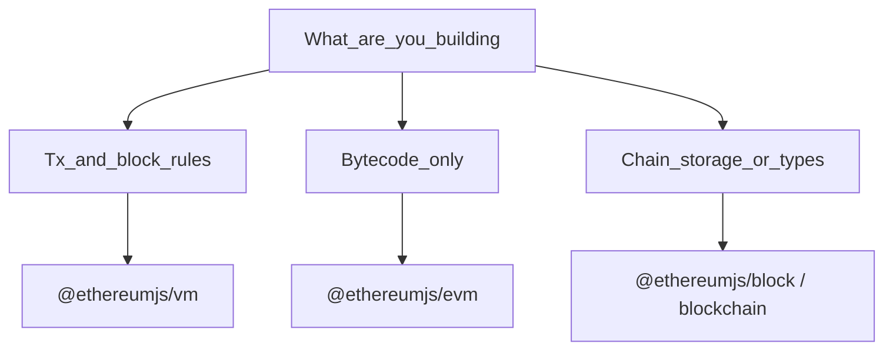
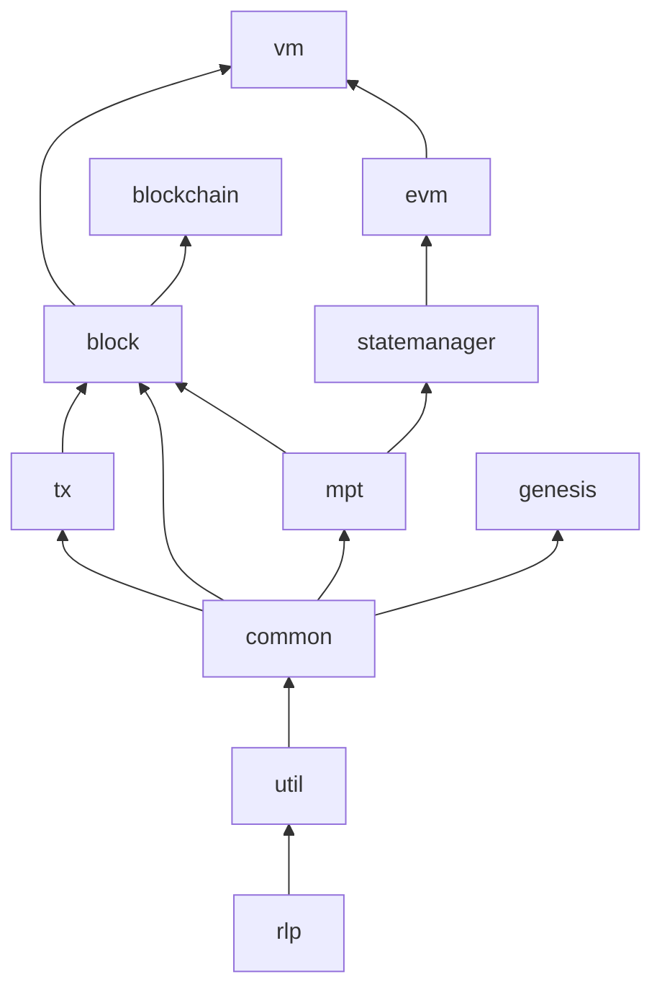

<p align="center">
  
</p>

<p align="center">
  
</p>

# EthereumJS Monorepo

**Modular TypeScript libraries for Ethereum execution-layer protocol work.**

[](https://codecov.io/gh/ethereumjs/ethereumjs-monorepo)
[](https://discord.gg/TNwARpR)

Composable, spec-tested building blocks for the [Ethereum](https://ethereum.org) execution layer: EVM execution, transactions, blocks, state, tries, and chain configuration. Use them in Node.js or the browser — tree-shakeable, Noble crypto by default, WASM-free unless you opt in.

- **Spec-tested execution** — `@ethereumjs/vm` and `@ethereumjs/evm` track mainnet hardforks (Osaka today; Amsterdam in development)
- **Composable primitives** — mix `tx`, `block`, `mpt`, `statemanager`, and friends instead of pulling in a full client
- **Browser-ready** — controlled dependency set; package READMEs cover bundler and KZG setup where needed

Maintained by former members of the [Ethereum Foundation](https://ethereum.foundation/) JavaScript team and the broader Ethereum community.

## What do you want to do?

| Goal | Start here | npm package |
| ---- | ---------- | ----------- |
| Run a signed tx, replay a block, or build a block | [packages/vm](./packages/vm) | `@ethereumjs/vm` |
| Execute bytecode, custom opcodes, or precompiles | [packages/evm](./packages/evm) | `@ethereumjs/evm` |
| Create, sign, or parse transactions | [packages/tx](./packages/tx) | `@ethereumjs/tx` |
| Blocks, headers, withdrawals | [packages/block](./packages/block) | `@ethereumjs/block` |
| Persistent chain storage | [packages/blockchain](./packages/blockchain) | `@ethereumjs/blockchain` |
| Merkle proofs and trie tooling | [packages/mpt](./packages/mpt) | `@ethereumjs/mpt` |
| Chain config and hardfork parameters | [packages/common](./packages/common) | `@ethereumjs/common` |


```mermaid
flowchart TD
  start[What_are_you_building]
  start --> txRules[Tx_and_block_rules]
  start --> bytecode[Bytecode_only]
  start --> chainData[Chain_storage_or_types]

  txRules --> vmPkg["@ethereumjs/vm"]
  bytecode --> evmPkg["@ethereumjs/evm"]
  chainData --> blockPkg["@ethereumjs/block / blockchain"]
```

## Quick start

Install the VM (includes EVM, tx, and state wiring):

```shell
npm install @ethereumjs/vm @ethereumjs/common @ethereumjs/tx @ethereumjs/util
```

Run a simple signed transfer against an in-memory state (adapted from [`packages/vm/examples/runTx.ts`](./packages/vm/examples/runTx.ts)):

```ts
import { Common, Hardfork, Mainnet } from '@ethereumjs/common'
import { createLegacyTx } from '@ethereumjs/tx'
import {
  createAccount,
  createAddressFromPrivateKey,
  createZeroAddress,
  hexToBytes,
} from '@ethereumjs/util'
import { createVM, runTx } from '@ethereumjs/vm'

const common = new Common({ chain: Mainnet, hardfork: Hardfork.Prague })
const vm = await createVM({ common })

const senderKey = hexToBytes(`0x${'20'.repeat(32)}`)
const sender = createAddressFromPrivateKey(senderKey)
await vm.stateManager.putAccount(sender, createAccount({ nonce: 0n, balance: BigInt(1e18) }))

const tx = createLegacyTx({
  gasLimit: 21000n,
  gasPrice: 1_000_000_000n,
  value: 1n,
  to: createZeroAddress(),
}).sign(senderKey)

const res = await runTx(vm, { tx })
console.log(res.totalGasSpent) // 21000n
```

For bytecode-only execution use `@ethereumjs/evm` ([examples](./packages/evm/examples/)). For blob (EIP-4844) transactions you need a separate KZG library — see [KZG setup](./packages/tx/README.md#kzg-setup) in the tx README.

## Package map

Active packages (published in sync on v10; see [`scripts/release-npm.ts`](./scripts/release-npm.ts)):

### Codec and primitives

| Package | Role | Docs |
| ------- | ---- | ---- |
| [`@ethereumjs/rlp`](./packages/rlp) [](https://www.npmjs.com/package/@ethereumjs/rlp) | RLP encode/decode | [README](./packages/rlp/README.md) |
| [`@ethereumjs/util`](./packages/util) [](https://www.npmjs.com/package/@ethereumjs/util) | Bytes, accounts, addresses, signatures | [README](./packages/util/README.md) |

### Configuration

| Package | Role | Docs |
| ------- | ---- | ---- |
| [`@ethereumjs/common`](./packages/common) [](https://www.npmjs.com/package/@ethereumjs/common) | Chains, hardforks, EIP parameters | [README](./packages/common/README.md) |
| [`@ethereumjs/genesis`](./packages/genesis) [](https://www.npmjs.com/package/@ethereumjs/genesis) | Genesis state for known chains | [README](./packages/genesis/README.md) |

### Protocol types

| Package | Role | Docs |
| ------- | ---- | ---- |
| [`@ethereumjs/tx`](./packages/tx) [](https://www.npmjs.com/package/@ethereumjs/tx) | Legacy, 1559, 2930, 4844, 7702 transactions | [README](./packages/tx/README.md) |
| [`@ethereumjs/block`](./packages/block) [](https://www.npmjs.com/package/@ethereumjs/block) | Blocks, headers, withdrawals | [README](./packages/block/README.md) |

### State

| Package | Role | Docs |
| ------- | ---- | ---- |
| [`@ethereumjs/mpt`](./packages/mpt) [](https://www.npmjs.com/package/@ethereumjs/mpt) | Merkle Patricia Trie and proofs | [README](./packages/mpt/README.md) |
| [`@ethereumjs/binarytree`](./packages/binarytree) [](https://www.npmjs.com/package/@ethereumjs/binarytree) | EIP-7864 binary tree | [README](./packages/binarytree/README.md) |
| [`@ethereumjs/statemanager`](./packages/statemanager) [](https://www.npmjs.com/package/@ethereumjs/statemanager) | Merkle, RPC, and binary-tree state backends | [README](./packages/statemanager/README.md) |

### Execution

| Package | Role | Docs |
| ------- | ---- | ---- |
| [`@ethereumjs/evm`](./packages/evm) [](https://www.npmjs.com/package/@ethereumjs/evm) | EVM interpreter, opcodes, precompiles | [README](./packages/evm/README.md) |
| [`@ethereumjs/vm`](./packages/vm) [](https://www.npmjs.com/package/@ethereumjs/vm) | `runTx`, `runBlock`, block building | [README](./packages/vm/README.md) |

### Chain storage

| Package | Role | Docs |
| ------- | ---- | ---- |
| [`@ethereumjs/blockchain`](./packages/blockchain) [](https://www.npmjs.com/package/@ethereumjs/blockchain) | Canonical chain storage and validation | [README](./packages/blockchain/README.md) |

### Other packages

| Package | Role | Notes |
| ------- | ---- | ----- |
| [`@ethereumjs/e2store`](./packages/e2store) [](https://www.npmjs.com/package/@ethereumjs/e2store) | Era / Era1 / E2HS archive formats | Deprecation [under consideration](./packages/e2store/README.md) |
| [`@ethereumjs/ethash`](./packages/ethash) [](https://www.npmjs.com/package/@ethereumjs/ethash) | Ethash PoW verification | Maintained for deps; not in active release round |

## How packages fit together


```mermaid
flowchart BT
  rlp --> util --> common
  common --> tx & block & mpt & genesis
  mpt --> block & statemanager
  tx --> block --> vm
  statemanager --> evm --> vm
  block --> blockchain
```

Full responsibility matrix, execution flow (`runBlock` → `runTx` → `evm`), and release notes: **[ARCHITECTURE.md](./ARCHITECTURE.md)**.

## Contribute

**Releases:** active development on [`master`](https://github.com/ethereumjs/ethereumjs-monorepo) (v10). Maintenance branches and breaking-release policy: [DEVELOPER.md § Releases](./DEVELOPER.md#releases).

**Clone and build:**

```sh
git clone https://github.com/ethereumjs/ethereumjs-monorepo.git
cd ethereumjs-monorepo
git submodule update --init
npm install
```

Tooling, CI, conventions, and release process: **[DEVELOPER.md](./DEVELOPER.md)** · **[CONTRIBUTING.md](./.github/CONTRIBUTING.md)**.

<details>
<summary>Deprecated packages (no longer updated)</summary>

| Package | Role |
| ------- | ---- |
| [`@ethereumjs/client`](./packages/client) | Full execution client (deprecated) |
| [`@ethereumjs/devp2p`](./packages/devp2p) | devp2p networking (deprecated) |
| [`@ethereumjs/wallet`](./packages/wallet) | Key management helpers (deprecated) |

Still on npm for migration reference; do not start new projects on these packages.

</details>

## Community

The `EthereumJS` GitHub organization is maintained by the former Ethereum Foundation JavaScript team and contributors. Join [Discord](https://discord.gg/TNwARpR) for questions and follow the [Code of Conduct](./CODE_OF_CONDUCT.md).

**Related:** [Lodestar](https://github.com/ChainSafe/lodestar) — TypeScript consensus client and SSZ tooling for the Ethereum consensus layer.

## License

Most packages are [MPL-2.0](https://tldrlegal.com/license/mozilla-public-license-2.0-(mpl-2)) licensed; see each package folder for its license file.
