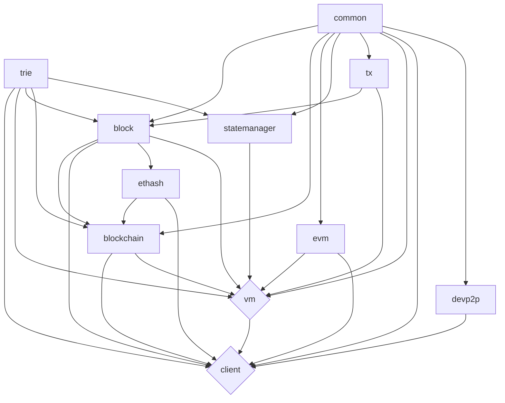

  

# EthereumJS Monorepo

[![Code Coverage][coverage-badge]][coverage-link]
[![Discord][discord-badge]][discord-link]
[![GitPOAP][gitpoap-badge]][gitpoap-link]

## Packages

Below you can find a list of the packages included in this repository.

| package                                          | npm                                                             | issues                                                                        | tests                                                                      | coverage                                                                    |
| ------------------------------------------------ | --------------------------------------------------------------- | ----------------------------------------------------------------------------- | -------------------------------------------------------------------------- | --------------------------------------------------------------------------- |
| [@ethereumjs/block][block-package]               | [![NPM Package][block-npm-badge]][block-npm-link]               | [![Block Issues][block-issues-badge]][block-issues-link]                      | [![Actions Status][block-actions-badge]][block-actions-link]               | [![Code Coverage][block-coverage-badge]][block-coverage-link]               |
| [@ethereumjs/blockchain][blockchain-package]     | [![NPM Package][blockchain-npm-badge]][blockchain-npm-link]     | [![Blockchain Issues][blockchain-issues-badge]][blockchain-issues-link]       | [![Actions Status][blockchain-actions-badge]][blockchain-actions-link]     | [![Code Coverage][blockchain-coverage-badge]][blockchain-coverage-link]     |
| [@ethereumjs/client][client-package]             | [![NPM Package][client-npm-badge]][client-npm-link]             | [![Client Issues][client-issues-badge]][client-issues-link]                   | [![Actions Status][client-actions-badge]][client-actions-link]             | [![Code Coverage][client-coverage-badge]][client-coverage-link]             |
| [@ethereumjs/common][common-package]             | [![NPM Package][common-npm-badge]][common-npm-link]             | [![Common Issues][common-issues-badge]][common-issues-link]                   | [![Actions Status][common-actions-badge]][common-actions-link]             | [![Code Coverage][common-coverage-badge]][common-coverage-link]             |
| [@ethereumjs/devp2p][devp2p-package]             | [![NPM Package][devp2p-npm-badge]][devp2p-npm-link]             | [![Devp2p Issues][devp2p-issues-badge]][devp2p-issues-link]                   | [![Actions Status][devp2p-actions-badge]][devp2p-actions-link]             | [![Code Coverage][devp2p-coverage-badge]][devp2p-coverage-link]             |
| [@ethereumjs/ethash][ethash-package]             | [![NPM Package][ethash-npm-badge]][ethash-npm-link]             | [![Ethash Issues][ethash-issues-badge]][ethash-issues-link]                   | [![Actions Status][ethash-actions-badge]][ethash-actions-link]             | [![Code Coverage][ethash-coverage-badge]][ethash-coverage-link]             |
| [@ethereumjs/evm][evm-package]                   | [![NPM Package][evm-npm-badge]][evm-npm-link]                   | [![EVM Issues][evm-issues-badge]][evm-issues-link]                            | [![Actions Status][evm-actions-badge]][evm-actions-link]                   | [![Code Coverage][evm-coverage-badge]][evm-coverage-link]                   |
| [@ethereumjs/rlp][rlp-package]                   | [![NPM Package][rlp-npm-badge]][rlp-npm-link]                   | [![rlp Issues][rlp-issues-badge]][rlp-issues-link]                            | [![Actions Status][rlp-actions-badge]][rlp-actions-link]                   | [![Code Coverage][rlp-coverage-badge]][rlp-coverage-link]                   |
| [@ethereumjs/statemanager][statemanager-package] | [![NPM Package][statemanager-npm-badge]][statemanager-npm-link] | [![StateManager Issues][statemanager-issues-badge]][statemanager-issues-link] | [![Actions Status][statemanager-actions-badge]][statemanager-actions-link] | [![Code Coverage][statemanager-coverage-badge]][statemanager-coverage-link] |
| [@ethereumjs/trie][trie-package]                 | [![NPM Package][trie-npm-badge]][trie-npm-link]                 | [![Trie Issues][trie-issues-badge]][trie-issues-link]                         | [![Actions Status][trie-actions-badge]][trie-actions-link]                 | [![Code Coverage][trie-coverage-badge]][trie-coverage-link]                 |
| [@ethereumjs/tx][tx-package]                     | [![NPM Package][tx-npm-badge]][tx-npm-link]                     | [![Tx Issues][tx-issues-badge]][tx-issues-link]                               | [![Actions Status][tx-actions-badge]][tx-actions-link]                     | [![Code Coverage][tx-coverage-badge]][tx-coverage-link]                     |
| [@ethereumjs/util][util-package]                 | [![NPM Package][util-npm-badge]][util-npm-link]                 | [![Util Issues][util-issues-badge]][util-issues-link]                         | [![Actions Status][util-actions-badge]][util-actions-link]                 | [![Code Coverage][util-coverage-badge]][util-coverage-link]                 |
| [@ethereumjs/vm][vm-package]                     | [![NPM Package][vm-npm-badge]][vm-npm-link]                     | [![VM Issues][vm-issues-badge]][vm-issues-link]                               | [![Actions Status][vm-actions-badge]][vm-actions-link]                     | [![Code Coverage][vm-coverage-badge]][vm-coverage-link]                     |

## Branches

The following are our currently active branches:

| Branch                                                                                  | Release Series | Status   |  Description                                                |
| --------------------------------------------------------------------------------------- | -------------- | -------- | ----------------------------------------------------------- |
| [master](https://github.com/ethereumjs/ethereumjs-monorepo)                             | v6             | `Beta`   | Main working branch, current v6 work merged in (2022-06-08) |
| [v5-maintenance](https://github.com/ethereumjs/ethereumjs-monorepo/tree/v5-maintenance) | v5             | `Active` | Maintenance for v5 releases                                 |

Please open PRs towards one of the active branches.

To inspect code related to a specific package version, refer to the [tags](https://github.com/ethereumjs/ethereumjs-monorepo/tags).

## Coverage report

Detailed version can be seen on [Codecov.io][coverage-link]

[][coverage-link]

## Package dependency relationship

To update the diagram above edit the README file and open a new PR with the changes.

## Getting Started

See our [monorepo](config/MONOREPO.md) documentation to get started on setting up the repository and installing dependencies. The [config](config/) folder gives an overview on shared configuration and scripts between packages.

# EthereumJS

See our organizational [documentation](https://ethereumjs.readthedocs.io) for an introduction to `EthereumJS` as well as information on current standards and best practices.

If you want to join for work or do improvements on the libraries have a look at our [contribution guidelines](https://ethereumjs.readthedocs.io/en/latest/contributing.html).

# LICENSE

Most packages are [MPL-2.0](<https://tldrlegal.com/license/mozilla-public-license-2.0-(mpl-2)>) licensed, see package folder for the respective license.

[coverage-badge]: https://codecov.io/gh/ethereumjs/ethereumjs-monorepo/branch/master/graph/badge.svg
[coverage-link]: https://codecov.io/gh/ethereumjs/ethereumjs-monorepo
[discord-badge]: https://img.shields.io/static/v1?logo=discord&label=discord&message=Join&color=blue
[discord-link]: https://discord.gg/TNwARpR
[stackexchange-badge]: https://img.shields.io/badge/ethereumjs-stackexchange-brightgreen
[stackexchange-link]: https://ethereum.stackexchange.com/questions/tagged/ethereumjs
[block-package]: ./packages/block
[block-npm-badge]: https://img.shields.io/npm/v/@ethereumjs/block.svg
[block-npm-link]: https://www.npmjs.com/package/@ethereumjs/block
[block-issues-badge]: https://img.shields.io/github/issues/ethereumjs/ethereumjs-monorepo/package:%20block?label=issues
[block-issues-link]: https://github.com/ethereumjs/ethereumjs-monorepo/issues?q=is%3Aopen+is%3Aissue+label%3A"package%3A+block"
[block-actions-badge]: https://github.com/ethereumjs/ethereumjs-monorepo/workflows/Block/badge.svg
[block-actions-link]: https://github.com/ethereumjs/ethereumjs-monorepo/actions?query=workflow%3A%22Block%22
[block-coverage-badge]: https://codecov.io/gh/ethereumjs/ethereumjs-monorepo/branch/master/graph/badge.svg?flag=block
[block-coverage-link]: https://codecov.io/gh/ethereumjs/ethereumjs-monorepo/tree/master/packages/block
[blockchain-package]: ./packages/blockchain
[blockchain-npm-badge]: https://img.shields.io/npm/v/@ethereumjs/blockchain.svg
[blockchain-npm-link]: https://www.npmjs.com/package/@ethereumjs/blockchain
[blockchain-issues-badge]: https://img.shields.io/github/issues/ethereumjs/ethereumjs-monorepo/package:%20blockchain?label=issues
[blockchain-issues-link]: https://github.com/ethereumjs/ethereumjs-monorepo/issues?q=is%3Aopen+is%3Aissue+label%3A"package%3A+blockchain"
[blockchain-actions-badge]: https://github.com/ethereumjs/ethereumjs-monorepo/workflows/Blockchain/badge.svg
[blockchain-actions-link]: https://github.com/ethereumjs/ethereumjs-monorepo/actions?query=workflow%3A%22Blockchain%22
[blockchain-coverage-badge]: https://codecov.io/gh/ethereumjs/ethereumjs-monorepo/branch/master/graph/badge.svg?flag=blockchain
[blockchain-coverage-link]: https://codecov.io/gh/ethereumjs/ethereumjs-monorepo/tree/master/packages/blockchain
[client-package]: ./packages/client
[client-npm-badge]: https://img.shields.io/npm/v/@ethereumjs/client.svg
[client-npm-link]: https://www.npmjs.com/package/@ethereumjs/client
[client-issues-badge]: https://img.shields.io/github/issues/ethereumjs/ethereumjs-monorepo/package:%20client?label=issues
[client-issues-link]: https://github.com/ethereumjs/ethereumjs-monorepo/issues?q=is%3Aopen+is%3Aissue+label%3A"package%3A+client"
[client-actions-badge]: https://github.com/ethereumjs/ethereumjs-monorepo/workflows/Client/badge.svg
[client-actions-link]: https://github.com/ethereumjs/ethereumjs-monorepo/actions?query=workflow%3A%22Client%22
[client-coverage-badge]: https://codecov.io/gh/ethereumjs/ethereumjs-monorepo/branch/master/graph/badge.svg?flag=client
[client-coverage-link]: https://codecov.io/gh/ethereumjs/ethereumjs-monorepo/tree/master/packages/client
[common-package]: ./packages/common
[common-npm-badge]: https://img.shields.io/npm/v/@ethereumjs/common.svg
[common-npm-link]: https://www.npmjs.com/package/@ethereumjs/common
[common-issues-badge]: https://img.shields.io/github/issues/ethereumjs/ethereumjs-monorepo/package:%20common?label=issues
[common-issues-link]: https://github.com/ethereumjs/ethereumjs-monorepo/issues?q=is%3Aopen+is%3Aissue+label%3A"package%3A+common"
[common-actions-badge]: https://github.com/ethereumjs/ethereumjs-monorepo/workflows/Common/badge.svg
[common-actions-link]: https://github.com/ethereumjs/ethereumjs-monorepo/actions?query=workflow%3A%22Common%22
[common-coverage-badge]: https://codecov.io/gh/ethereumjs/ethereumjs-monorepo/branch/master/graph/badge.svg?flag=common
[common-coverage-link]: https://codecov.io/gh/ethereumjs/ethereumjs-monorepo/tree/master/packages/common
[devp2p-package]: ./packages/devp2p
[devp2p-npm-badge]: https://img.shields.io/npm/v/@ethereumjs/devp2p.svg
[devp2p-npm-link]: https://www.npmjs.com/package/@ethereumjs/devp2p
[devp2p-issues-badge]: https://img.shields.io/github/issues/ethereumjs/ethereumjs-monorepo/package:%20devp2p?label=issues
[devp2p-issues-link]: https://github.com/ethereumjs/ethereumjs-monorepo/issues?q=is%3Aopen+is%3Aissue+label%3A"package%3A+devp2p"
[devp2p-actions-badge]: https://github.com/ethereumjs/ethereumjs-monorepo/workflows/Devp2p/badge.svg
[devp2p-actions-link]: https://github.com/ethereumjs/ethereumjs-monorepo/actions?query=workflow%3A%22Devp2p%22
[devp2p-coverage-badge]: https://codecov.io/gh/ethereumjs/ethereumjs-monorepo/branch/master/graph/badge.svg?flag=devp2p
[devp2p-coverage-link]: https://codecov.io/gh/ethereumjs/ethereumjs-monorepo/tree/master/packages/devp2p
[ethash-package]: ./packages/ethash
[ethash-npm-badge]: https://img.shields.io/npm/v/@ethereumjs/ethash.svg
[ethash-npm-link]: https://www.npmjs.org/package/@ethereumjs/ethash
[ethash-issues-badge]: https://img.shields.io/github/issues/ethereumjs/ethereumjs-monorepo/package:%20ethash?label=issues
[ethash-issues-link]: https://github.com/ethereumjs/ethereumjs-monorepo/issues?q=is%3Aopen+is%3Aissue+label%3A"package%3A+ethash"
[ethash-actions-badge]: https://github.com/ethereumjs/ethereumjs-monorepo/workflows/Ethash/badge.svg
[ethash-actions-link]: https://github.com/ethereumjs/ethereumjs-monorepo/actions?query=workflow%3A%22Ethash%22
[ethash-coverage-badge]: https://codecov.io/gh/ethereumjs/ethereumjs-monorepo/branch/master/graph/badge.svg?flag=ethash
[ethash-coverage-link]: https://codecov.io/gh/ethereumjs/ethereumjs-monorepo/tree/master/packages/ethash
[evm-package]: ./packages/evm
[evm-npm-badge]: https://img.shields.io/npm/v/@ethereumjs/evm.svg
[evm-npm-link]: https://www.npmjs.org/package/@ethereumjs/evm
[evm-issues-badge]: https://img.shields.io/github/issues/ethereumjs/ethereumjs-monorepo/package:%20evm?label=issues
[evm-issues-link]: https://github.com/ethereumjs/ethereumjs-monorepo/issues?q=is%3Aopen+is%3Aissue+label%3A"package%3A+evm"
[evm-actions-badge]: https://github.com/ethereumjs/ethereumjs-monorepo/workflows/EVM/badge.svg
[evm-actions-link]: https://github.com/ethereumjs/ethereumjs-monorepo/actions?query=workflow%3A%22evm%22
[evm-coverage-badge]: https://codecov.io/gh/ethereumjs/ethereumjs-monorepo/branch/master/graph/badge.svg?flag=evm
[evm-coverage-link]: https://codecov.io/gh/ethereumjs/ethereumjs-monorepo/tree/master/packages/evm
[gitpoap-badge]: https://public-api.gitpoap.io/v1/repo/ethereumjs/ethereumjs-monorepo/badge
[gitpoap-link]: https://www.gitpoap.io/gh/ethereumjs/ethereumjs-monorepo
[tx-package]: ./packages/tx
[tx-npm-badge]: https://img.shields.io/npm/v/@ethereumjs/tx.svg
[tx-npm-link]: https://www.npmjs.com/package/@ethereumjs/tx
[tx-issues-badge]: https://img.shields.io/github/issues/ethereumjs/ethereumjs-monorepo/package:%20tx?label=issues
[tx-issues-link]: https://github.com/ethereumjs/ethereumjs-monorepo/issues?q=is%3Aopen+is%3Aissue+label%3A"package%3A+tx"
[tx-actions-badge]: https://github.com/ethereumjs/ethereumjs-monorepo/workflows/Tx/badge.svg
[tx-actions-link]: https://github.com/ethereumjs/ethereumjs-monorepo/actions?query=workflow%3A%22Tx%22
[tx-coverage-badge]: https://codecov.io/gh/ethereumjs/ethereumjs-monorepo/branch/master/graph/badge.svg?flag=tx
[tx-coverage-link]: https://codecov.io/gh/ethereumjs/ethereumjs-monorepo/tree/master/packages/tx
[trie-package]: ./packages/trie
[trie-npm-badge]: https://img.shields.io/npm/v/@ethereumjs/trie.svg
[trie-npm-link]: https://www.npmjs.com/package/@ethereumjs/trie
[trie-issues-badge]: https://img.shields.io/github/issues/ethereumjs/ethereumjs-monorepo/package:%20trie?label=issues
[trie-issues-link]: https://github.com/ethereumjs/ethereumjs-monorepo/issues?q=is%3Aopen+is%3Aissue+label%3A"package%3A+trie"
[trie-actions-badge]: https://github.com/ethereumjs/ethereumjs-monorepo/workflows/Trie/badge.svg
[trie-actions-link]: https://github.com/ethereumjs/ethereumjs-monorepo/actions?query=workflow%3A%22Trie%22
[trie-coverage-badge]: https://codecov.io/gh/ethereumjs/ethereumjs-monorepo/branch/master/graph/badge.svg?flag=trie
[trie-coverage-link]: https://codecov.io/gh/ethereumjs/ethereumjs-monorepo/tree/master/packages/trie
[rlp-package]: ./packages/rlp
[rlp-npm-badge]: https://img.shields.io/npm/v/@ethereumjs/rlp.svg
[rlp-npm-link]: https://www.npmjs.com/package/@ethereumjs/rlp
[rlp-issues-badge]: https://img.shields.io/github/issues/ethereumjs/ethereumjs-monorepo/package:%20rlp?label=issues
[rlp-issues-link]: https://github.com/ethereumjs/ethereumjs-monorepo/issues?q=is%3Aopen+is%3Aissue+label%3A"package%3A+rlp"
[rlp-actions-badge]: https://github.com/ethereumjs/ethereumjs-monorepo/workflows/rlp/badge.svg
[rlp-actions-link]: https://github.com/ethereumjs/ethereumjs-monorepo/actions?query=workflow%3A%22rlp%22
[rlp-coverage-badge]: https://codecov.io/gh/ethereumjs/ethereumjs-monorepo/branch/master/graph/badge.svg?flag=rlp
[rlp-coverage-link]: https://codecov.io/gh/ethereumjs/ethereumjs-monorepo/tree/master/packages/rlp
[util-package]: ./packages/util
[util-npm-badge]: https://img.shields.io/npm/v/@ethereumjs/util.svg
[util-npm-link]: https://www.npmjs.org/package/@ethereumjs/util
[util-issues-badge]: https://img.shields.io/github/issues/ethereumjs/ethereumjs-monorepo/package:%20util?label=issues
[util-issues-link]: https://github.com/ethereumjs/ethereumjs-monorepo/issues?q=is%3Aopen+is%3Aissue+label%3A"package%3A+util"
[util-actions-badge]: https://github.com/ethereumjs/ethereumjs-monorepo/workflows/Util/badge.svg
[util-actions-link]: https://github.com/ethereumjs/ethereumjs-monorepo/actions?query=workflow%3A%22Util%22
[util-coverage-badge]: https://codecov.io/gh/ethereumjs/ethereumjs-monorepo/branch/master/graph/badge.svg?flag=util
[util-coverage-link]: https://codecov.io/gh/ethereumjs/ethereumjs-monorepo/tree/master/packages/util
[statemanager-package]: ./packages/statemanager
[statemanager-npm-badge]: https://img.shields.io/npm/v/@ethereumjs/statemanager.svg
[statemanager-npm-link]: https://www.npmjs.com/package/@ethereumjs/statemanager
[statemanager-issues-badge]: https://img.shields.io/github/issues/ethereumjs/ethereumjs-monorepo/package:%20statemanager?label=issues
[statemanager-issues-link]: https://github.com/ethereumjs/ethereumjs-monorepo/issues?q=is%3Aopen+is%3Aissue+label%3A"package%3A+statemanager"
[statemanager-actions-badge]: https://github.com/ethereumjs/ethereumjs-monorepo/workflows/StateManager/badge.svg
[statemanager-actions-link]: https://github.com/ethereumjs/ethereumjs-monorepo/actions?query=workflow%3A%22StateManager%22
[statemanager-coverage-badge]: https://codecov.io/gh/ethereumjs/ethereumjs-monorepo/branch/master/graph/badge.svg?flag=statemanager
[statemanager-coverage-link]: https://codecov.io/gh/ethereumjs/ethereumjs-monorepo/tree/master/packages/statemanager
[vm-package]: ./packages/vm
[vm-npm-badge]: https://img.shields.io/npm/v/@ethereumjs/vm.svg
[vm-npm-link]: https://www.npmjs.com/package/@ethereumjs/vm
[vm-issues-badge]: https://img.shields.io/github/issues/ethereumjs/ethereumjs-monorepo/package:%20vm?label=issues
[vm-issues-link]: https://github.com/ethereumjs/ethereumjs-monorepo/issues?q=is%3Aopen+is%3Aissue+label%3A"package%3A+vm"
[vm-actions-badge]: https://github.com/ethereumjs/ethereumjs-monorepo/workflows/VM/badge.svg
[vm-actions-link]: https://github.com/ethereumjs/ethereumjs-monorepo/actions?query=workflow%3A%22VM%22
[vm-coverage-badge]: https://codecov.io/gh/ethereumjs/ethereumjs-monorepo/branch/master/graph/badge.svg?flag=vm
[vm-coverage-link]: https://codecov.io/gh/ethereumjs/ethereumjs-monorepo/tree/master/packages/vm
